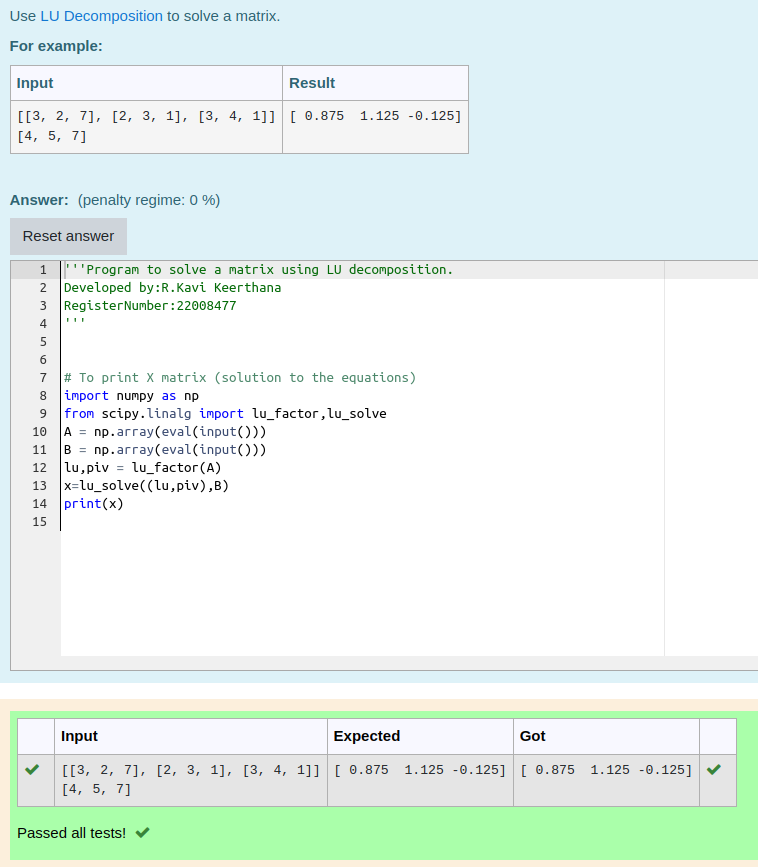

# LU Decomposition 

## AIM:
To write a program to find the LU Decomposition of a matrix.

## Equipments Required:
1. Hardware – PCs
2. Anaconda – Python 3.7 Installation / Moodle-Code Runner

## Algorithm
1. Import numpy package as np
2. From scipy package import lu
3. Get input from the user
4. Print result

## Program:
(i) To find the L and U matrix
```

'''Program to find L and U matrix using LU decomposition.
Developed by:R.Kavi Keerthana 
RegisterNumber:22008477 
'''
import numpy as np
from scipy.linalg import lu
A = np.array(eval(input()))
P,L,U=lu(A)
print(L)
print(U)

```


(ii) To find the LU Decomposition of a matrix
```

'''Program to find the LU Decomposition of a matrix.
Developed by: R.Kavi Keerthana
RegisterNumber: 22008477
'''
# To print X matrix (solution to the equations)
import numpy as np
from scipy.linalg import lu_factor,lu_solve
A = np.array(eval(input()))
B = np.array(eval(input()))
lu,piv = lu_factor(A)
x=lu_solve((lu,piv),B)
print(x)
```

## Output:




## Result:
Thus the program to find the LU Decomposition of a matrix is written and verified using python programming.

